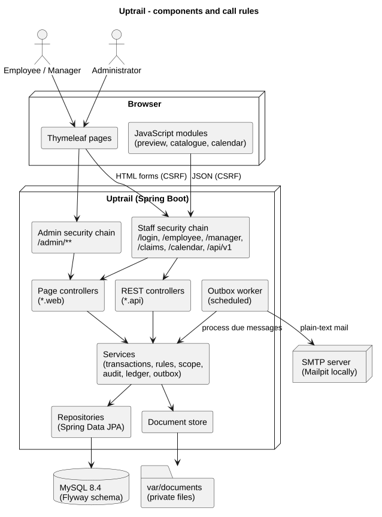
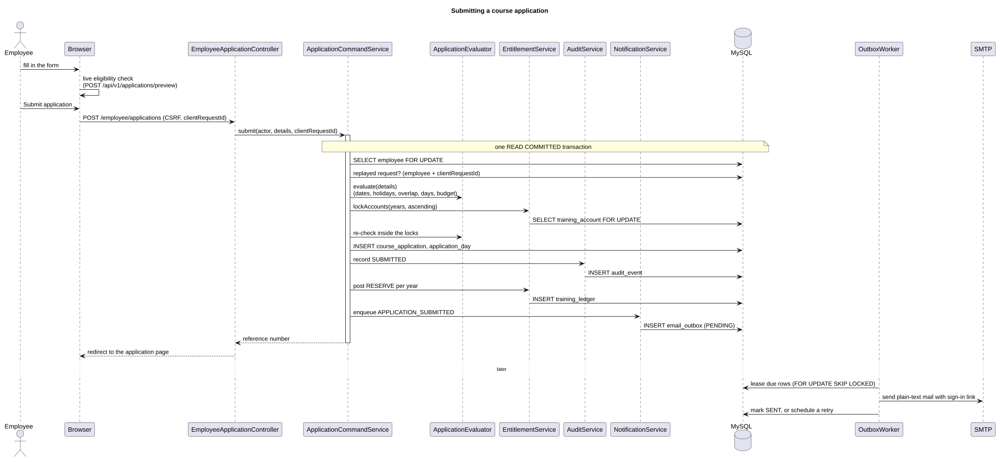

# Uptrail — architecture

Uptrail is a single Spring Boot application with server-rendered pages, a small JSON API for the browser, and a MySQL database. This document explains how the code is organised and which rules every change follows. Diagrams are in [diagrams/](diagrams/README.md).

## Modules

The code lives under `com.uptrail`, one package per business area. Each area is split into `domain` (JPA entities and value types), `repository` (Spring Data interfaces), `service` (use cases), `web` (page controllers) and `api` (REST controllers) where needed.

| Package | Responsibility |
| --- | --- |
| `identity` | Accounts, roles, sign-in, the two security chains, session control |
| `organisation` | Employees, approval routing, the access-scope policy |
| `catalogue` | Categories, providers, catalogue courses, public holidays and calendar years |
| `entitlement` | Annual accounts, the ledger, balances, the training-day calculator, My Entitlement |
| `application` | Course applications: evaluation, preview, submission, lifecycle commands and employee pages |
| `approval` | Manager worklist, review page and team history |
| `claim` | Fee claims, documents, the private document store and reimbursement registration |
| `reporting` | Training calendar, participation and budget reports, CSV exports |
| `notification` | Email outbox, mail rendering, transports and the worker |
| `audit` | Audit events and the audit service |
| `admin` | Administration and operations pages; services that span several areas |
| `sample` | Synthetic sample organisation and activity for the `dev` profile |
| `shared` | Clock, error codes and handlers, transactions, formatting, paging, CSV writer |

Call rules, checked by `ArchitectureTest` (ArchUnit):

- Controllers live in `web` or `api` packages and call services only; they never touch repositories.
- Repositories are used by services (and by the sample-data loader).
- Domain classes do not depend on services, repositories or the web layer; they change state through intention-revealing methods such as `approve(...)` or `registerReimbursement(...)`.
- REST controllers return records, never JPA entities. Spring Data REST is not used.

## Security

- **Two workspaces, two filter chains.** `/admin/**` is served by the administration chain (sign-in at `/admin/login`); everything else by the staff chain (`/login`). A session remembers which entry point it signed in through, so an administrator's session cannot open staff pages and a staff session cannot open administration pages, even for a person who holds both roles.
- **Roles and scope.** URL rules check the role; services check the record: employees see only their own records, managers the records of their direct reports or records assigned to or decided by them, administrators the administration data. A record outside the caller's scope is reported as not found (404), so its existence is not revealed.
- **CSRF** protection is on for every form and every JSON `POST`. No state changes on `GET`.
- **Responses.** Denied page requests show the 403 page and unauthenticated page requests go to the sign-in page; API requests get JSON 401/403 instead. Business errors on pages are shown next to the form fields; unexpected errors show an error page with a correlation id and no internal details.
- **Headers.** A strict Content-Security-Policy (`default-src 'self'`, `frame-ancestors 'none'`, no inline scripts or styles), `X-Frame-Options: DENY`, `X-Content-Type-Options: nosniff` and `Referrer-Policy: same-origin`.
- **Sessions** are registered, so changing a person's roles, deactivating them or resetting their password ends their open sessions. Sign-out is a `POST`. The `next` parameter of the sign-in page only accepts local paths of the same workspace.
- **Passwords** are stored as BCrypt hashes.
- **Documents** are stored outside the web root under server-generated names and downloaded only through authorised endpoints (see [api.md](api.md#document-downloads)).

## Write protocol

Every command that changes business data follows the same protocol (`@WriteTransaction`, READ COMMITTED):

1. Lock the applicant's `employee` row. All writes for one person are therefore serialised, which also serialises their budget.
2. Lock the involved `training_account` rows in ascending year (for an update: the union of the old and new years).
3. Lock the target application or claim and compare the version the user saw (`expectedVersion`); a changed record gives 409 and the user sees the current version.
4. Re-check every rule inside the locks: identity, route, status, calendar years, schedule, overlap, days, budget.
5. Write the record, one `audit_event`, the net `training_ledger` rows and the `email_outbox` rows in the same transaction.
6. Commit. Mail is sent later by the worker; an SMTP outage never rolls back a business change.

Submissions carry a client request id: a repeated submission with the same id and the same content returns the first result instead of creating a second application. Lock waits and deadlocks are reported as 503 "try again". The concurrency tests race two real transactions against MySQL for each critical case (same budget, same period, duplicate decisions, duplicate reimbursement, concurrent mail workers).

## Business rules in one place

- `TrainingDayCalculator` turns a period into counted half-days: weekends and public holidays are excluded, the first and last day must be working days, half days are allowed for internal training only, and days are split by calendar year.
- `ApplicationEvaluator` applies all application rules and is shared by the live preview and by the commands, so the preview and the final check cannot disagree.
- `ClaimPolicy` holds the fee claim rules; `AccessScopePolicy` holds the data-scope rules.
- The business date comes from `BusinessClock` (Asia/Singapore). Tests replace the clock; the sample-data loader runs past steps at past instants through the same services.

State machines: [applications](diagrams/svg/application-states.svg), [claims](diagrams/svg/claim-states.svg), [calendar years](diagrams/svg/calendar-year-states.svg).

## Ledger

Balances are computed from ledger rows, never stored as running totals; see [data-model.md](data-model.md#balances-come-from-the-ledger). The ledger separates pending reservations, approved commitments and reimbursed amounts, so a registered reimbursement never reduces the budget a second time. The operations page can recompute all balances from the records and report any difference.

## Email

Notifications are rows in `email_outbox`, written in the business transaction. The worker (every 10 seconds by default):

1. leases a batch of due messages with `SELECT … FOR UPDATE SKIP LOCKED` in a short transaction,
2. renders each one from a plain-text template (`src/main/resources/mail/`) and sends it outside any transaction,
3. records the result in its own transaction while its lease is still current.

Failed sends are retried after 1, 2, 4 and 8 minutes; after five attempts the message is `FAILED` and an administrator can queue it again. A message whose worker stopped is picked up again when its lease expires, so delivery is at least once. Each email contains a sign-in link that opens the related page after sign-in. Transports: SMTP (Mailpit locally) or text files in `var/mail-capture/`.

## Documents

Claim documents (receipt and certificate of completion) must be PDF, PNG or JPEG files of at most 5 MB whose first bytes match the format and whose name has the matching extension. The store writes each file to a temporary name and moves it to `var/documents/yyyy/MM/<uuid>.<ext>`. If the transaction rolls back, the file is deleted; a scheduled sweep removes files that no row references and that are older than one hour. The database keeps the original name (for display only), the detected type, the size and a SHA-256 checksum.

## Front end

Thymeleaf templates with one layout, fragments for recurring parts, Bootstrap 5.3.8 served from the application (webjar) and `uptrail.css` following [DESIGN.md](../DESIGN.md). Three small JavaScript files add the live eligibility check, the catalogue search, the calendar, confirmations and file-size checks; every page also works as a plain form without them, except the live checks. Pages are usable at phone width (tables scroll inside their card) and reports have a print layout.

## Configuration and profiles

| Profile | Use |
| --- | --- |
| default | Production-like: credentials from environment variables, no sample data, template caching |
| `dev` | Local development: Docker Compose MySQL on port 3307, Mailpit, sample data loaded into an empty database |

Settings are listed in the [README](../README.md#configuration).

## Tests

| Level | Tools | Examples |
| --- | --- | --- |
| Unit | JUnit 5, AssertJ | calculator, status transitions, CSV writer, document rules, mail rendering, architecture rules |
| Integration | Spring Boot test, MockMvc, Testcontainers `mysql:8.4`, GreenMail | submission and lifecycle rules, concurrency races, administration, reports, claims, mail delivery, authorization matrix |
| End-to-end | Playwright (profile `e2e`) | employee, manager and administrator flow in a real browser, phone width and print |

Integration tests fail when no database is available; they never skip. The results of each run are recorded in `Plan.md` section 9.
