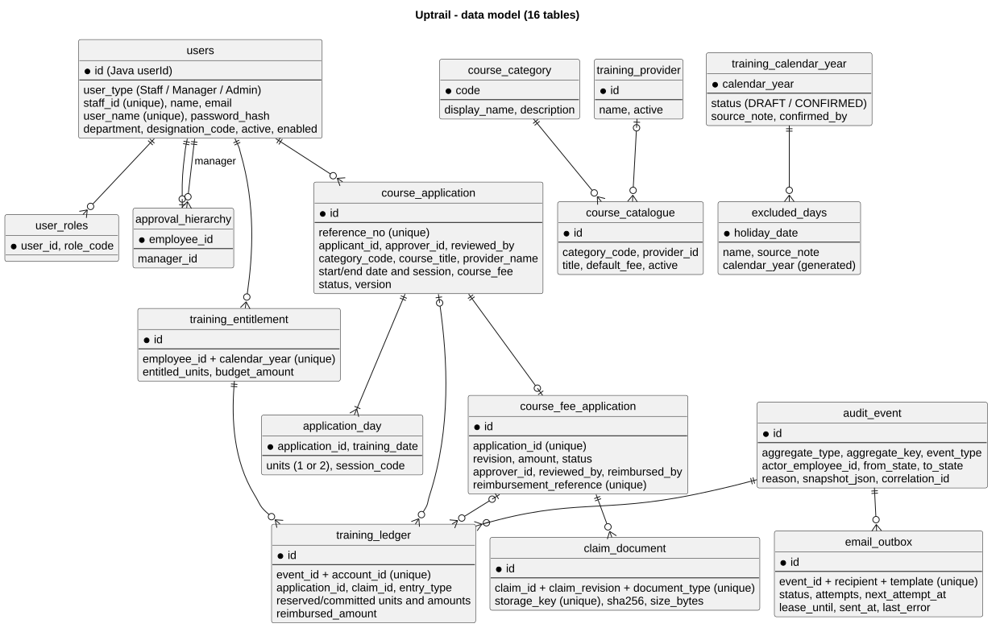

# Uptrail data model

User -> Staff -> Manager and User -> Admin share users with a user_type discriminator. Java userId maps to the preserved database primary key id; staffId maps to staff_id. Historical references retain identity across role changes.

| Table | Purpose |
| --- | --- |
| users | Identity/subtype/profile, user_name, BCrypt hash, active/enabled state/version |
| user_roles | Permissions for the same user_id; Manager includes STAFF |
| approval_hierarchy | Current direct employee-manager assignment; no self-assignment |
| training_entitlement | Annual days/budget limits, unique per user/year |
| course_category | Three fixed categories |
| training_provider | Providers |
| course_catalogue | Optional catalogue |
| training_calendar_year | Draft/confirmed year/source evidence |
| excluded_days | Public holidays/source notes; weekends calculated |
| course_application | Applicant/approver/course snapshot/lifecycle/decision metadata |
| application_day | Per-working-day half-day allocation |
| course_fee_application | Completed-course claim/decision/reimbursement |
| claim_document | Receipt/certificate metadata and private storage keys |
| audit_event | Author/business change |
| training_ledger | Net reservations/commitments/reimbursement |
| email_outbox | Payload/retry/lease/delivery |

## Routing and history

applicantId/approverId are User database IDs, not staffId strings. Read-only applicant/assignedManager associations resolve those columns. Decisions require current Manager permission; history still loads after someone ceases to be manager.

ApprovalHierarchy and the application snapshot have different purposes. Routing preserves old decisions; pending reassignment is explicit. Course/claim scope is consistent.

## Balances and constraints

TrainingEntitlement owns annual limits. Ledger movements reserve, commit or release days/budget and register reimbursement without charging a course twice. Time uses integer half days; money DECIMAL/BigDecimal SGD; internal courses are free. User/Staff do not duplicate yearly budgets.

Foreign keys preserve referenced history. Client request IDs prevent duplicate submission; versions reject stale decisions. Category/status/date/fee/reason constraints complement validation. Deactivation and credential/role changes expire sessions.

Published V1-V5 remain unchanged. V6 preserves old employee IDs, merges credentials/permissions into users and aligns tables plus applicant_id/decision_reason. Upgrade tests verify a seeded V5 application's applicant, approver, author, reason and version in V6.

Documents stay private. Audit/ledger/outbox commit with the action; email is sent afterwards with role-appropriate login links.
